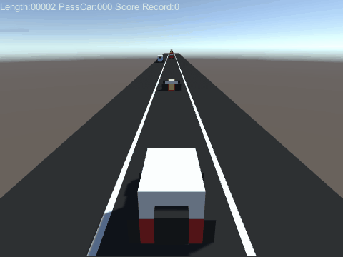

# ml-agents-demo
This is a simple repo for playing with [Unity3D ML-Agents](https://github.com/Unity-Technologies/ml-agents).

# Simple Car
This demo will try to use ML-Agent to play a simple car game.

## Assets Used in AssetStore
- [Voxel Cars Prototype](https://assetstore.unity.com/packages/3d/voxel-cars-prototype-79163)

## What I want to do
No path finding or drive along the winding path. I build up a simple endless highway on which the player should drive in traffic and dodge other vehicles, like the Arcade Game. Then I add a camera, which can generate a depth texture, on front of player's car. **The goal is to train an agent to control the car depending on learning the depth texture.**

## What I have done

-  The first problem is that ML-Agents **could not use Depth Texture as Visual Observation directly**. This is one of limitations of visual observations, so I decide to just use vector observations to transfer the depth texture data. While the PPO model will deal with visual observations and vector ones in different ways. (only CNN for visual ones). I make my own custom trainer and model which will **reshape vector inputs into images format** and feed it into convolutional layers.
-  I tried the PPO model and got no luck. In the very beginning, I want the agent to action like human player. Every frame it collects the depth texture and then decide to turn left or right, or just stay straight. If it crashes a car or drive out the road, the agent will be reset with a negative reward, otherwise it could get a tiny reward. I tried several reward formulas and the agent would rather just stay straight forever or action randomly. I also tried "On Demand Decisions", and it changed nothing. 
-  Then I suppose to simplify the game, which is that the agent only needs to tell whether there is a vehicle in front of it or not. In general, a simple depth texture classifier could get the job done. However, PPO model is not 
designed for this kind of tasks and I wasted another bunch of time to realize that. Thus I change the [my trainer](https://github.com/catoxliu/ml-agents-demo/tree/master/mlagent_python/unitytrainers/custom) to **take the reward as the label** to the observation and use the same loss function and optimizer to BehavioralCloningTrainer. Finally, I got a worked agent :)
-  Make a step forward: 

## Custom Model with Only Danger Detection
### Results

### Observation
An agent camera on front of the player car which will collect a 40*16 depth texture and send it as a 640-float vector observation to brain. The depth texture could be seen on left-top corner of the screen.

### Output Actions
Brain gives agent 2 discrete action: 0 for nothing ahead, 1 for danger. If 1 is received and then player car will change its track automatically.

### Reward
Reward is label. So SetReward(0) if no vehicle in front of player (around 10 meters ahead, it could be adjusted) or SetReward(1). In training mode, I will let the player change its track as late as possible, which will generate more "efficient" data. 

## Custom Model with Danger&Tracks Detection
### Results

### Observation
The same to DangerDetection one.

### Output Actions
Expand action on the basis of DangerDetection. 0x00 means nothing ahead. 0x01 means ahead vehicle is on right side track. 0x10 means ahead vehicle is on middle track. 0x11 means ahead vehicle is on left track. And this time, player will only steer 1 meter per frame.

### Reward
The same, reward is label.

